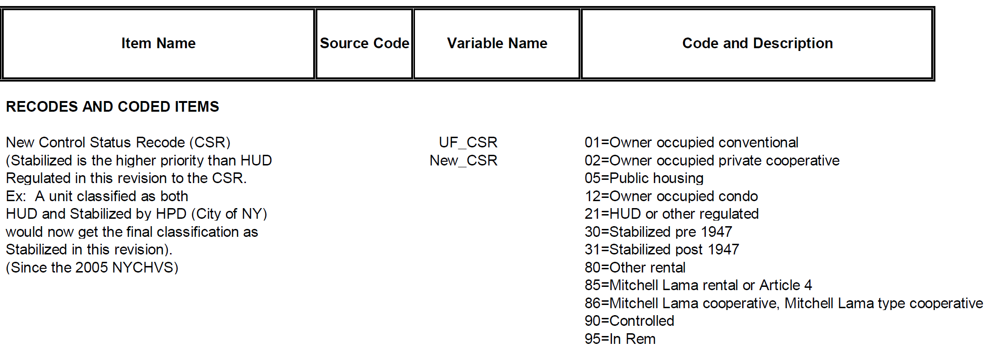

```{r setup, echo=FALSE, include=FALSE}
knitr::opts_chunk$set(echo = FALSE, message = FALSE, warning = F)

library(tidyverse)
library(scales)
library(ggsci)
all_data <- read_csv("..//Datasets//all_data.csv")
`%!in%` <- Negate(`%in%`)
```

## Background:
The New York City Housing and Vacancy Survey (NYCHVS)[^fn1] is conducted roughly every three years on a large representative sample by field representatives of the Census Bureau and sponsored by the New York City Department of Housing Preservation and Development. It is one of the longest-running surveys in the country, with data going back to 1965.  Roughly every decade, a representative sample of housing units is selected to represent the core sample between the three-year periods. Both occupied and vacant units are monitored, with formal interviews being conducted on inhabitants of occupied units. Variable sets are somewhat consistent overtime with notable additions and revisions over time. The data set primarily consists of categorical data concerning housing conditions, inhabitant demographics, and unit characteristics such as rent control.

## Introduction:
New York City is an exciting population to collect data from due to the complex nature of the city structure and culture; nationwide trends are often incongruent with the densely populated streets of New York. Over the past five decades, New York City has seen a dramatic transformation, incomes have risen, crime has fallen, and housing conditions have improved considerably. However, significant portions of the city still live in deteriorating or dilapidated structures. It is interesting to investigate how housing quality has varied over time and which inhabitants face the harshest conditions. Quantifying housing conditions can be difficult as many measures cut the housing distribution too coarsely.  

In March of 2013, the U.S. Department of Housing and Urban Development published *American Housing Survey: A Measure of (Poor) Housing Quality*[^fn2], which detailed a process for creating a robust index to measure housing quality, which they name the Poor Housing Quality Index (PQI). Given the similar structure of the American Housing Survey and NYCHVS, we will use their approach as a general guideline for modeling housing quality in New York City.

## Approach

### Data Strucutre
The data are available from the [NYCHVS site](https://www.census.gov/programs-surveys/nychvs.html). We are using occupied files that are available via public request. For ease of access,  the data is also on the [GitHub repo](https://github.com/ahernnelson/STAT-579-Project). We are analyzing ten datasets, which we will aggregate into one cohesive dataset for analysis. Each dataset comes with two headers, a variable id, and a variable description. Variable values are given by codebooks (also available on GitHub). Note, special is taken when combining the data as some variables are not included in every data year. We must specify the data columns that will be utilized for analysis. 
The selected variables mainly consist of integer coded categorical variables that need to be cleaned and prepped. For our analysis, we identified 34 variables across the ten surveys that will be useful for research. Most of these variables are binary and describe deficiencies in housing units and will be used in our housing quality index. We provide a full breakdown of the index and its variables later.

### Aggregation
To aggregate the data, we have compiled two R scripts to help aid the process. The first, *get_nychvs.R*, contains a function for reading in data for each year available and an option to read variable descriptions given the column ids. The second file, *merger.R*, selects the appropriate columns from each data set, corrects any conflicts, and merges the ten subsets of data into one. Further, we utilize this time to compute our housing quality index. 

This process identifies the appropriate variables and recodes them with the proper weight given in the [index table](#### Figure 1: Index Table). Upon calculating the index, we write the data to a local file, *all_data.csv*. We reference this file for the remainder of the analysis.

### Index Calculation
We will consider data from 10 surveys collected from 1991-2017 in all five boroughs of New York City and construct our index by measuring the prevalence of physical deficiencies impacting units in the city. The index will formally be defined as the weighted sum of indicator variables. The weighting of indicators is mostly uniform with minor adjustments by the author. The difference in weights is subjectively determined; for example, it is the author's opinion that a unit with broken or missing windows is worse than a unit with broken plaster or peeling paint. The author has no data regarding the extent of these deficiencies, and further analysis for choosing optimal weights is recommended.  

We have attempted to calculate our index from a consistent variable set overtime; however, some variables are unique to later years. If data for a variable is not available or missing, we award units the benefit of the doubt and assume that the issue is not present. A full breakdown of the index is available below.

#### Figure 1: Index Table

| Item | Description      | NYCHVS Variable | Score |
| ---- | ---------------- | --------------- | ----- |
| 1 | Exterior Walls: Missing brick, sliding or other | d1 | 2 |
| 2 | Exterior Walls: Sloping or bulgin walls | d2 | 2 |
| 3 | Exterior walls: Major Cracks | d3 | 2 |
| 4 | Exterior Walls: Loose or hanging corvice, roof, etc. | d4 | 2 |
| 5 | Interior Walls: Cracks or holes | 36a | 2 |
| 6 | Interior Walls: Broken plaster or peeling paint | 37a | 2 |
| 7 | Broken or missing windows | e1 | 5 |
| 8 | Rotten or loose windows | e2 | 2 |
| 9 | Boarded up windows | e3 | 3 |
| 10 | Sagging or sloping floors | g1 | 2 |
| 11 | Slanted/shifted doorsills or frames | g2 | 2 |
| 12 | Deep wear in floor causing depressions | g3 | 2 |
| 13 | Holes or missing flooring | g4 | 2 |
| 14 | Stairs: Loose, broken, or missing stair | f1 | 2 |
| 15 | Stairs: Loose, broken, or missing setps | f2 | 2 |
| 16 | No interior steps or stairways | f4 | 2 |
| 17 | No exterior steps or stairways | f5 | 2 |
| 18 | Number of heating equipment breakdowns | 32b | 2 per break down |
| 19 | Kitchen facilities fucntioning | 26c | 3 if no; 5 if no kitchen facilities |
| 20 | Toilet Breakdowns | 25c | 3 if any; 5 if no toliet or plumbing |
| 21 | Presence of mice or rats | 35a | 3 |
| 22 | Water Leakage | 38a | 3 |

## Evaluating the Index
Now that we have designed an index for measuring poor housing quality, let’s consider an example of how it works in practice. Consider a unit with boarded up windows, two heating equipment breakdowns, and no toilet or plumbing. Then this unit would score: 3 + 2(2) + 5 = 12 on the Poor Housing Quality Index. Likewise, a unit with no detected issues would be 0. A note is in order; our index is an ordinal measure meaning that while a unit with a PQI of 6 is measured as worse than a unit with a PQI of 3, it is not twice as bad. Due to both the coarse nature of data and subjective weighting, it is not necessarily a “better or worse” place to live. Even so, PQI is a useful tool for gauging housing quality.

With some understanding of PQI, let’s look more in-depth at how our index performs, what it might tell us, and how it varies over time. The first plot we are going to look at is of linear trends in different parameters of the PQI distribution.

```{r more trends, fig.dim=c(11,6)}
source("..//3-Graphs//index_trends.R")
fig_2
```

A noteworthy point here is that in almost every year, a majority of houses score have a PQI of zero, i.e., no detected deficiencies. The year 2008 had the highest number of units with an index score of zero (64%). We also see a general trend of more units measuring zero and less extreme PQI scores as we progress through time.


## Exploratory Analysis: Rental Status and PQI

Now many questions start to arise. What is driving the improvement in housing units over time? How does it relate to variation in income? Rent? For this report, we have a particular interest in the relationship between rent and PQI. For example, would we expect a difference in quality between units that are rented out and owned? Initial investigations indicate yes.

```{r, fig.dim=c(11,6)}
source("..//3-Graphs//pqi_rent_vs_owned_over_time.R")
fig_3
```

We performed a log transformation on our index to help stabilize the high variance inherent to PQI. This transformation was performed by shifting PQI up one unit and taking the natural log. This lets us view the data on a level scale across the groups of interest over time.

Investigating the plot shows an evident and apparent disparity between rental units and owner-occupied units. Every year, the median PQI is zero (in both log and true units) for owner-occupied units. Rental units, which comprise most of our data, have a non-zero median in eight of the ten years. Further, we have added loess curves for the trend in Log Mean PQI over time and see a clear and consistent gap between the two populations

```{r,include=FALSE}
all_data %>%
    mutate(Rent = if_else(mgrent > 9998, "Owner Occupied", "Renter Occupied"),
           lpqi = log(pqi+1)) %>%
    group_by(year, Rent) %>%
    summarise(n_outlier = sum(lpqi > quantile(lpqi, .75) + 1.5*IQR(lpqi))) %>%
    pivot_wider(names_from = year, values_from = n_outlier)
```

### Partition by Rental Status

The above is not a true partition of units by rental status. There are publicly subsidized units that do not hold a rent contract (but are not owned or owner-occupied). Further, it is of interest to look at subsets of rental units, particularly those regulated in NYC via stabilization or rent control. This data is captured in the *csr* variable and is coded as follows 

  

We aggregate this information into a coarser partition and limit the remainder of our analysis to the year 2017, as detailed by the code below.
```{r, echo = TRUE}
all_data %>%
    mutate(rent_control = 
             case_when(csr %in% c(1,2,12) ~ "Non Rental Property",
                       csr %in% c(5, 20, 21, 22, 23, 85, 86, 95) ~ "Other Regulation",
                       csr %in% c(30, 31, 90) ~ "Rent Controlled or Stabilized",
                       csr == 80 ~ "Unregulated")) -> rc_data

```


We can visualize the Log-Scale distribution for these groups below  

```{r, fig.dim=c(11,6)}
source("..//3-Graphs//rent_regulate.R")
fig_4
```

Note that rent-regulated and publicly funded units have higher sample medians than owner-occupied or unregulated units.


## Analysis
We select non-parametric methods for comparison of these groups. Namely, we wish to test for equalty of medians across the groups using a Kruskal-Wallis Test, and then we perfom one-sided Mann-Whitney U test for a pairwise comparison. Both of these tests are well suited to ordnial data and do yield significant results, but special care needs to be applied to our interpretation.

### Caveats
The data do not provide evidence that of constant variance across the four groups of residents.
```{r}
library(car)
leveneTest(pqi ~ rent_control, data = rc_data)
```

This means that we cannot conduct hypothesis about the median. Rather, for the Kruskal-Wallis Test, the null hypothesis is that the mean rank (as calculated by the test) is the same across groups. 

For the Mann-Whitney test, the null hypothesis is that there is no evidence of stochastic dominance, i.e., the alternavtive is that it is more likely to observe a higher value of PQI in the first group over second group.

### Results
```{r}
# Kruskal-Wallis ----------------------------------------------------------
kruskal.test(pqi ~ rent_control, data = rc_data)
```
The data provide evidence that the difference in mean ranks is significantly different between, owner-occupied, unregulated rental, regulated, and publicly subsidized units. That is, Some of these groups have a higher likelihood of containing units with a higher PQI than the others.


```{r}
# Rental Regulation
wilcox.test(pqi ~ case_when(rent_control == "Unregulated" ~ 0,
                            rent_control == "Rent Controlled or Stabilized" ~ 1,
                            TRUE ~ NA_real_), 
            data = rc_data, correct = F, alternative = "less")
```
The data provides significant evidence that, on average, rent-stabilized or rent-controlled units are more likely to have a higher PQI than unregulated rental units.

### Conclusion
In summary, we see that housing quality is continuing to improve over time in NYC. We examined partitioning units by their rental status and found this useful for detecting quality disparities between units. 

The gap between regulated and unregulated rental units is fascinating. It would be useful to know if this is an implicit consequence of such regulations or if external confounding factors influence this gap.

Moreover, further analysis into the quality of publicly subsidized housing would be of interest;  some preliminary research (not presented in this report) indicates that specific programs have a superior housing stock compared to others.

We have only examined a small fraction of the data, and components of the analysis could be enhanced. Namely, we would like to refine our index and investigate methods for optimal weighting. Some parameterizations result in more favorable distributions but alter the interpretation of the index. 

We did not have time to explore the relationship between resident attributes, such as race, ethnicity, immigration status, or social programs participation. These would be of interest to study and better identify which groups of people are at risk of occupying lesser quality homes.


[^fn1]: https://www.census.gov/programs-surveys/nychvs.html
[^fn2]: https://www.huduser.gov/publications/pdf/AHS_hsg.pdf

